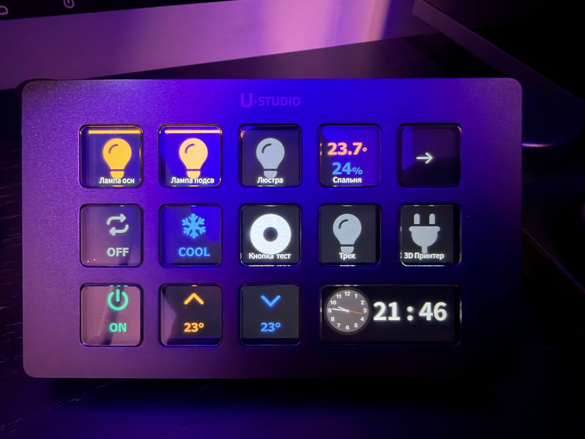

# Spruthub plugin for UlanziDeck

Control [Sprut.hub](https://spruthub.ru/) smart-home devices from a UlanziDeck /
U200 key. The plugin ships five actions covering lights, sockets, climate,
buttons and sensors — each key reflects its device's live state on the icon and
stays in sync via the hub's WebSocket push events.

<details>
<summary>How it looks on real device</summary>



</details>

## Actions

| Action | Device | On press | State on icon |
|---|---|---|---|
| **Bulb Toggle** | On/Off bulb | Flips On/Off | On/off bulb icon |
| **Socket Toggle** | Socket / switch | Flips On/Off | On/off socket icon |
| **Air Conditioner** | Thermostat / HeaterCooler | Cycles a mode / steps temp / toggles power (per role) | Live temp, mode, fan, swing |
| **Button Press** | Programmable button | Emits a stateless press (single / double / long) | Idle icon, flashes on press |
| **Sensor** | Temperature / humidity / air-quality sensor | Forces a refresh (read-only) | Live reading(s) |

Bulb Toggle and Socket Toggle share the same On/Off logic
(`SprutToggle.js`) — they differ only in icon set and UUID.

## How it works

- The plugin is a Node.js main service (`plugin/app.js`) that connects to
  UlanziStudio over WebSocket like any other plugin.
- It talks to Sprut.hub via the [`spruthub-client`](https://www.npmjs.com/package/spruthub-client)
  npm package (WebSocket JSON-RPC, handles the email/password/serial login).
- `plugin/actions/sprutClient.js` — a shared, authenticated client singleton.
  Exposes `setValue` / `readValue` (booleans), `sendValue` / `readRaw` (raw
  numbers) and `onCharacteristicChange()` for live push subscriptions.
- One action module per behaviour:
  - `SprutToggle.js` — On/Off toggle (Bulb + Socket). Flips the boolean
    characteristic on press and mirrors live pushes.
  - `SprutAC.js` — air conditioner. One action, many *roles* selected in the
    Property Inspector: `display` (large tile of temp/mode/fan/swing),
    `mode`, `fan`, `swing`, `temp_up`, `temp_down`, `power`.
  - `SprutButton.js` — writes an integer to a programmable-switch
    characteristic (0 = single, 1 = double, 2 = long press). Stateless.
  - `SprutSensor.js` — read-only display of temperature, humidity and/or
    air-quality (ppm), kept live via push events.
  - `icons.js` — renders the SVG/data-URI icons the actions draw.

## Configuration

Open the key's Property Inspector:

- **Spruthub Connection** (shared by all keys, saved to global settings):
  `WebSocket URL`, `Email`, `Password`, `Serial`.
- **Device** (per key) — the Accessory / Service / Characteristic IDs the
  action reads and writes:
  - **Toggle / Socket / Button**: `aId`, `sId`, `cId` (Button also takes a
    press value).
  - **Sensor**: one or both of a temperature triple (`tAId/tSId/tCId`) and a
    humidity triple (`hAId/hSId/hCId`); optional air-quality triple
    (`pAId/pSId/pCId`).
  - **Air Conditioner**: `aId`, the thermostat service `sSId`, plus the
    characteristic ids `curCId` (current temp), `tgtCId` (target),
    `modeCId`, `fanCId`, `swingCId`; optional `tempStep/tempMin/tempMax`.

Find the aId/sId/cId of your device from the Spruthub app / API. For the test
virtual bulb the values were `aId: 10294, sId: 13, cId: 15`.

## Test in the simulator

```bash
cp -R . ../../UlanziDeckSimulator/plugins/com.ulanzi.spruthub.ulanziPlugin
cd ../../UlanziDeckSimulator && npm install && npm start
# open http://127.0.0.1:39069, Refresh Plugin List
node plugins/com.ulanzi.spruthub.ulanziPlugin/dist/app.js   # start the main service
```

Drag any action onto a key, fill in the Property Inspector, then trigger the
key (right-click → run) and confirm the device responds and the icon updates.
